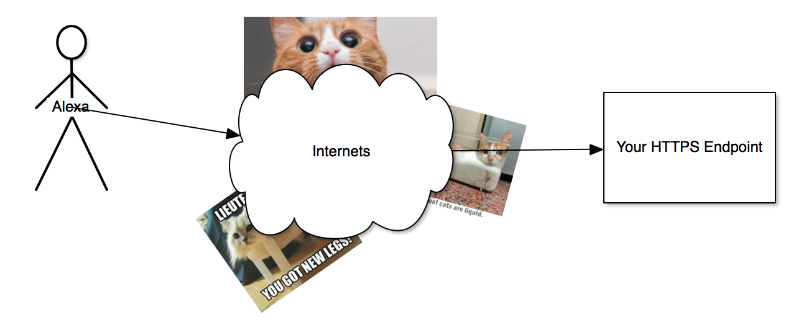

autoscale: true

# Developing Mad Skillz for Alexa


--- 

# Getting Started

To get started with Alexa skills, you'll need:

- An Amazon Developer account
- A web server (with HTTPS) or an AWS account
- A good (or stupid) idea

Skills can be written in whatever language you want, since they are just HTTPS endpoints. However, if you are using AWS Lamda, it's easiest to use Python or Node.

---

# What is an Alexa skill?

Alexa skills allow you to customize Alexa!

* Smart Home Skills
* Flash Briefings
* Skills

---

## Smart Home Skills

- **Alexa, turn on the living room light.**
- **Alexa, lock the front door.**

Smart Home Skills are special skills that don't need to be named to be used. You provide a device during the discovery phase and you interact with your device using the device name.

---

### Smart Home Skills - Great


- You don't need to use awkward language to use your skill.
    **Alexa, tell the front door to lock itself.**
    
- The discovered device is shown in the Alexa app as a smart home device.

---

### Smart Home Skills - Not So Great

- Only a few idioms are supported
  - Lock/Unlock - **Alexa, lock the front door**
  - Percentage - **Alexa, set the living room to 50 percent**
  - On/Off - **Alexa, turn off the living room light**
  - Temperature Control - **Alexa, what's the temperature of the living room?**

---

## Flash Briefings

Provide custom content for a user's flash briefing.

> ...
  There were 23 commits in dojo2 since yesterday.
  ...

---
## Custom Skills

Custom Skills provide a way for users to interact with Alexa.

- **Alexa, ask local farmer's markets for markets near Canton, NC**

---

## Custom Skills

- HTTP Endpoint
- Name
- Invocation Name
- Intents
- Slots

---

# [fit] Custom Skills are just HTTP end points



---

## Custom Skills
### Name

The name of your skill as displayed in your Amazon Dashboard and your Alexa app. This can be anything. You won't be using this to speak to Alexa.

---

## Custom Skills
### Invocation Name

The keywords to use to launch the app with Alexa.

**Alexa, ask local farmer's markets for markets near Canton, NC**

The invocation name is `local farmer's markets`.

---

## Custom Skills
### Intents

Intents reflect the different commands Alexa understands to send to your skill. A single skill can have many intents.

---
### Intents
#### `FindMarketsNearMe`
- **Alexa, ask local farmer's markets for markets near Asheville**
- **Alexa, ask local farmer's markets for markets near Asheville that sell honey**

#### `AMAZON.HelpIntent`
- **Alexa, ask local farmer's markets for help**

---

### Intents

Intents are descried using the __Intent Schema__. This is a special JSON format listing everything your skill can do.

```json
{
  "intents": [
    {
      "slots": [
        {
          "name": "City",
          "type": "AMAZON.AdministrativeArea"
        },
        {
          "name": "Sells",
          "type": "SELL_ITEM_LIST"
        }
      ],
      "intent": "FindMarketsNearMe"
    },
    {
      "intent": "AMAZON.HelpIntent"
    }
  ]
}
```

---

### Intents

Variables can be passed to your skill by using __Slots__. There are *many* built-in slots, but you can also create your own.

- Dates
- Time & Durations
- Numbers
- Locations (Cities, States, etc)
- Drinks, Foods, Desserts
- Animals, Music, Video Games

---

### Intents

Specify custom slots by giving a list of words or phrases that are valid for that slot.
```
organic items
baked goods
cheese
crafts
flowers
eggs
seafood
```

---

### Sample Utterances

The sample utterances are the connection between your Alexa, your intents, and your slots.

```
FindMarketsNearMe for markets near {City}
FindMarketsNearMe for farmers markets in {City}
FindMarketsNearMe for farmers markets near {City}
FindMarketsNearMe for markets in {City} that sell {Sells}
FindMarketsNearMe for markets in {City} that offer {Sells}
FindMarketsNearMe for markets near {City} that sell {Sells}
FindMarketsNearMe for markets near {City} that offer {Sells}
FindMarketsNearMe for farmers markets in {City} that sell {Sells}
FindMarketsNearMe for farmers markets in {City} that offer {Sells}
FindMarketsNearMe for farmers markets near {City} that sell {Sells}
FindMarketsNearMe for farmers markets near {City} that offer {Sells}
```

--- 
## Writing Custom Skills

Using the `alexa-sdk` module makes things **easy**.

```js
const alexa = require('alexa-sdk');

// Register your intents with the alexa SDK
exports.handler = function (event, context) {
    const alexa = Alexa.handler(event, context);
    alexa.registerHandlers({
        "MyIntent"() {
            this.emit(":tell", "Hello Skill!")
        }
    });
    alexa.execute();
};
```

---

## You can even make cards in the Alexa App

```js
this.emit(
  ':tellWithCard', 
  "Check your alexa app for a funny joke.", 
  "Funny Joke", 
  "Why do chicken coops only have 2 doors? Because otherwise they'd be chicken sedans!");
```

This will put the joke as a card in your Alexa app!

---

# What Else?

- Saved State
- Prompts
- Linked Accounts
- Share with the world

---

# References

- [`alexa-sdk`](https://github.com/alexa/alexa-skills-kit-sdk-for-nodejs)
- [`local-farmers-markets-skill`](https://github.com/rorticus/local-farmers-markets-skill)
- [Voice UI Design Handbook](https://developer.amazon.com/public/solutions/alexa/alexa-skills-kit/docs/alexa-skills-kit-voice-design-handbook)
- [Tutorials by Big Nerd Ranch](https://developer.amazon.com/alexa-skills-kit/big-nerd-ranch)